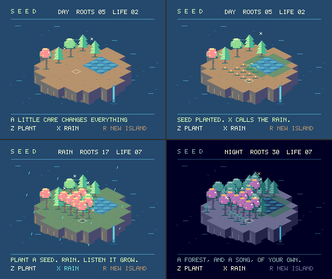

# SEED — 小さな浮島を育てる

種をまき、雨を呼び、森が音楽になっていくのを眺める庭です。
勝ち負けも制限時間もありません。最初の8秒間、操作せずにいると
自動で種まきと雨が始まります。操作すると、その後はあなたの庭になります。



```sh
npm run dev
# 表示されたローカルURLの末尾に /#seed を付ける
```

| 操作 | はたらき |
| --- | --- |
| 矢印 / WASD | 島の格子に沿って場所を選ぶ |
| Z / 地面をクリック | 空いた場所に種をまく |
| X / 右クリック | 島全体に雨を降らせる |
| R | 最初の島に戻す |
| 画面下の PLANT / RAIN / NEW ISLAND | 同じ操作をマウスで行う |

スマートフォンではランチャーの方向ボタンとZ・Xも使えます。
木に隠れた場所も、地面の菱形を指せば選択できます。

種は水のある土で3秒ほどかけて成長します。池の隣はいつも湿り、
それ以外は雨が頼りです。育った木は湿った隣の土地へ種を広げます。
水がなくても木は枯れません。ゆっくり試してください。

森が増えると虫が集まり、8本、12本、16本で音楽のパートが増えます。
旋律は木の座標から五音音階で作り、48秒で昼と夜を一周します。
庭の保存はありません。Rやデモの切り替えで最初に戻ります。

## このプロジェクトで作る理由

READMEの「三つの時計」を、ひとつの場所にしました。

- **TypeScriptの世界**：水分、成長、種の拡散、木の配置から作る旋律。
- **V9938の風景**：SCREEN 5の16色。変化した風景を本来の速度のブリッターで
  裏ページへ描き、完成してから表示。待ち仕事を積み増さず、次は最新の状態を描きます。
- **60Hzの生き物**：選択カーソル、虫、雨はハードウェアスプライト。
  風景を描いている間も動き、昼夜はパレットレジスターだけで変わります。

最初の風景と小さな操作欄だけは `gfx.now` で即時描画します。
音はYM2413のFM音源とAY-3-8910の鳥の声・雨のノイズです。
画像、フォント、録音素材、外部サービスのダウンロードは不要です。

目指したのは「昔の機械でどこまでできるか」だけでなく、現代の言語で作った
小さな世界に、昔の機械の色と音と時間を与えることです。
ここから庭づくりゲーム、環境音を作る楽器、小さな生態系の観察などへ伸ばせます。

## 画像と音を再現する

```sh
npm run seed -- /tmp/seed.png /tmp/seed.wav
```

最初の島、種まき後、雨で成長した森、夜の4枚を並べたPNGと、
同じ24秒間のエミュレーターの音をWAVに出力します。WAVの引数は省略できます。
乱数は固定シードなので同じ操作から同じ庭が育ちます。

`garden.ts` が描画に依存しない成長規則、`demo.ts` が画面・操作・音です。
`test/seed.test.ts` では水の必要性、拡散、座標選択、遅い描画中の操作と
リセットを確認しています。
